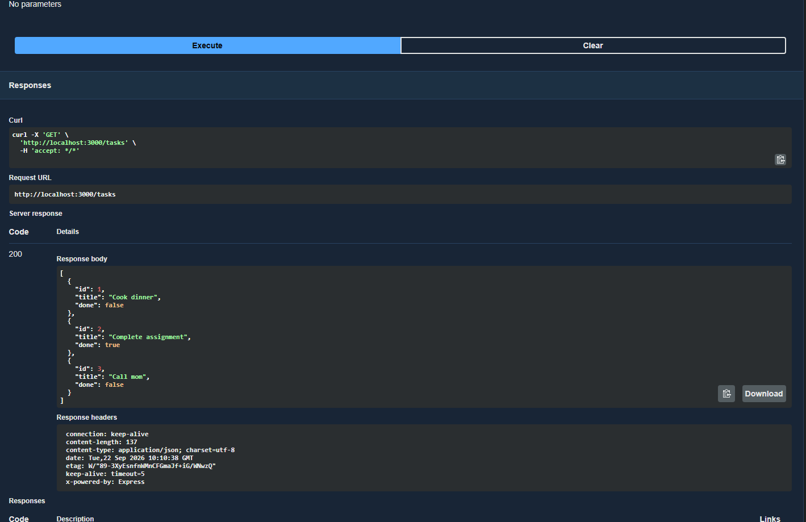
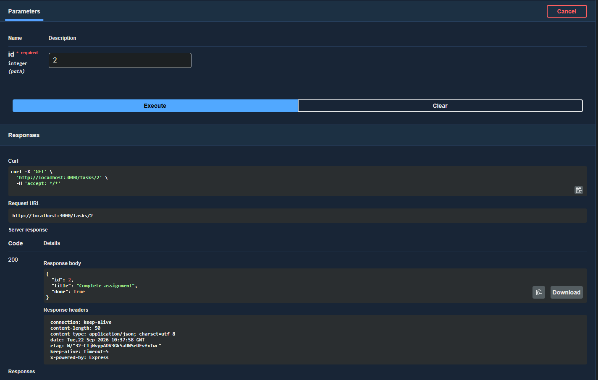
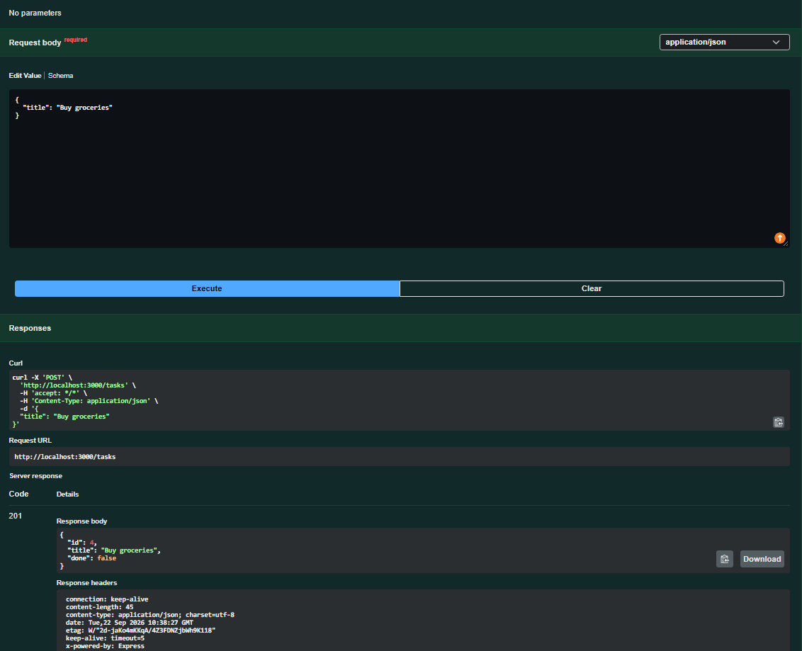
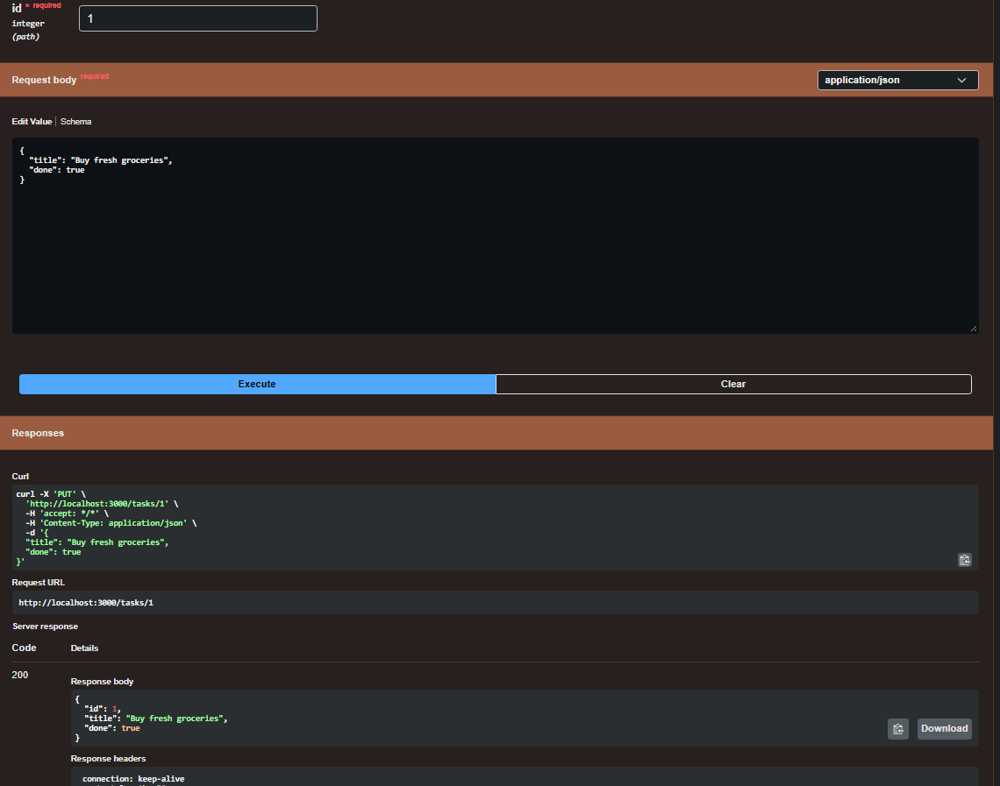
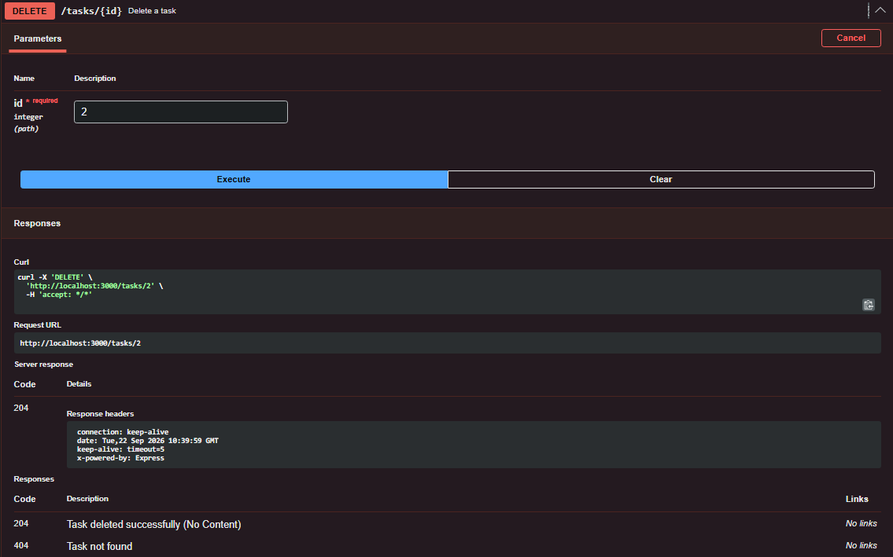

# Task API

A simple CRUD API built with Node.js and ExpressJS.
This an Assignment for FlyRank AI Internship


## Tech Stack

* **Runtime:** [Node.js](https://nodejs.org/)
* **Framework:** [Express.js](https://expressjs.com/)
* **API Documentation:** [Swagger UI Express](https://github.com/scottie1984/swagger-ui-express)

---

## Interactive API Documentation

Once the server is running, you can access the interactive Swagger UI documentation directly in your browser:

**[http://localhost:3000/docs](http://localhost:3000/docs)**

GET ALL

GET BY ID

POST

PUT

DELETE


---

## API Endpoints Summary

| Method | Endpoint | Description | Request Body | Expected Status Codes |
| :--- | :--- | :--- | :--- | :--- |
| **GET** | `/health` | Health check endpoint | None | `200 OK` |
| **GET** | `/tasks` | Retrieve all tasks | None | `200 OK` |
| **GET** | `/tasks/:id` | Retrieve single task by ID | None | `200 OK`, `404 Not Found` |
| **POST** | `/tasks` | Create a new task | `{"title": "String"}` | `201 Created`, `400 Bad Request` |
| **PUT** | `/tasks/:id` | Update task title and/or status | `{"title"?: "String", "done"?: Boolean}` | `200 OK`, `400 Bad Request`, `404 Not Found` |
| **DELETE** | `/tasks/:id` | Delete a task by ID | None | `204 No Content`, `404 Not Found` |

---

##  Getting Started

### Prerequisites

* [Node.js](https://nodejs.org/) (v18 or higher recommended)
* [Git](https://git-scm.com/)

### Installation & Setup

1. **Install dependencies:**
   ```bash
   npm install
   ```

2. **Start the server:**
   ```bash
   node index.js
   ```

The server will start running on **`http://localhost:3000`**.

---

##  curl

```bash
# Get all tasks
curl -i http://localhost:3000/tasks

# Create a task (POST)
curl -i -X POST http://localhost:3000/tasks \
  -H "Content-Type: application/json" \
  -d '{"title":"Buy milk"}'

# Update a task (PUT)
curl -i -X PUT http://localhost:3000/tasks/1 \
  -H "Content-Type: application/json" \
  -d '{"done":true}'

# Delete a task (DELETE)
curl -i -X DELETE http://localhost:3000/tasks/1
```